# thedatamustflow
#datavault #data-vault
  Visio stencils and artefacts related to data vault guru.
Click the link above for the downloadable stencil for Visio.
Use the art if you wish to create your own. And if you like upload your work to this repo.
The art and stencils are provided under Creative Commons licensing. 
 This work is licensed under a <a rel="license" href="http://creativecommons.org/licenses/by/4.0/">Creative Commons Attribution 4.0 International License</a>.
  Find the book at Amazon, Kindle and Paperpack, click [US](https://amzn.to/3d7LsJV), [UK](https://amzn.to/3nsqTfR) and [AU](https://amzn.to/30IxOYF)
  And now find your favourite book art available for purchase at RedBubble! Click https://rdbl.co/3uMEReY

* **Hub**
* **Link**
* **Satellite** 

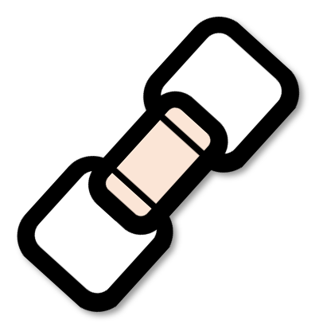
 

## Additional variations of links 
* **Link with a dependent-child key**
* **Hierarchy link (HAL)**
* **Same-as link (SAL)** 
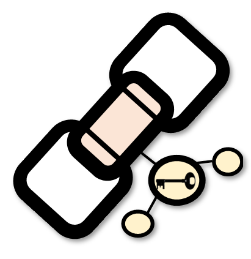

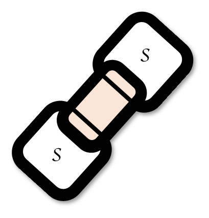 
HAL and SAL are conceptual representations of the relationship, in truth they are simply just links and a link may include a combination of relationships all represented in a single link. 

## Additional variations of satellites 
* **Satellite with dependent-child key**
* **Multi-active satellite**
* **Effectivity satellite** 
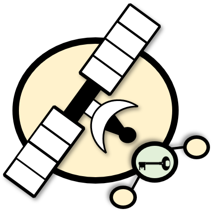
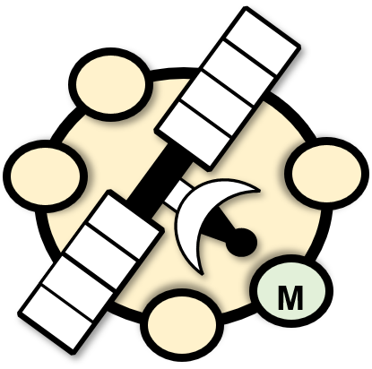
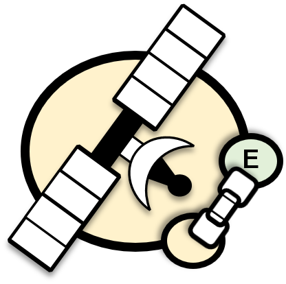 

## Peripheral satellites 
* **Record tracking satellite**
* **Status tracking satellite** 
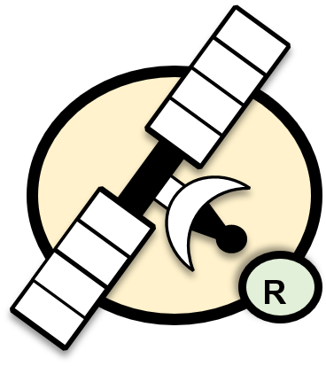
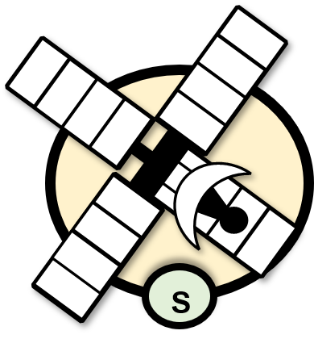 

## Time-line correction satellite 
* **Extended record tracking satellite** 
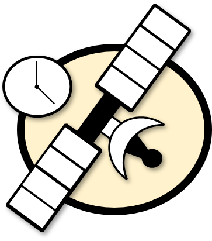 

## Business vault 
These are no different to raw vault artefacts except that we are storing the derived output using the above raw vault loading patterns.
* **Hub**
* **Link**
* **Link with dependent child key**
* **Exploration link**
* **Satellite**
* **Satellite with a dependent-child key**
* **Multi-active satellite** 
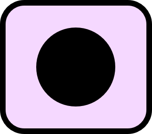
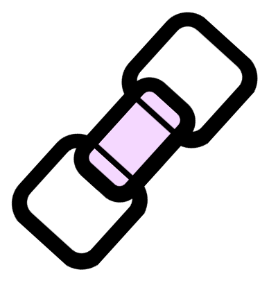
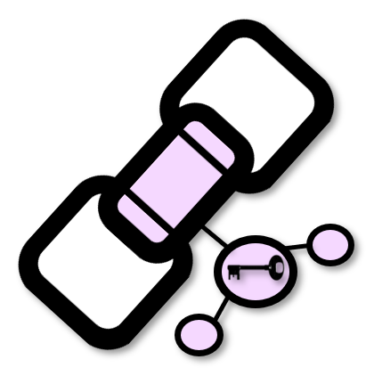
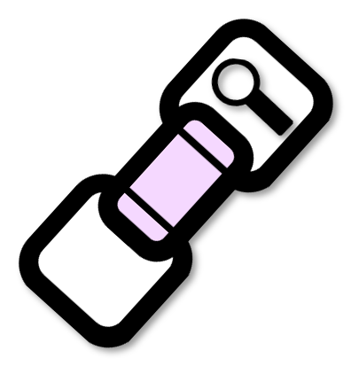

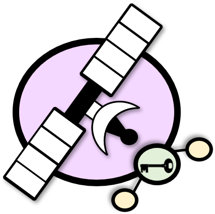
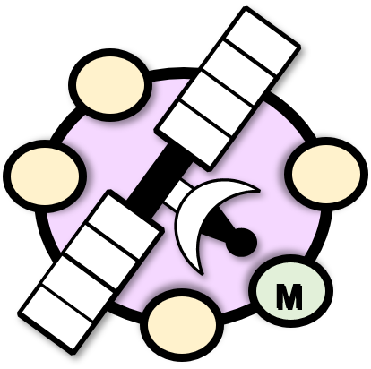 

## Reference data 
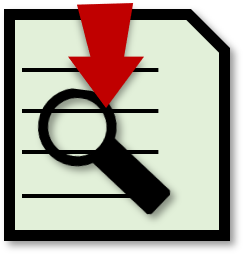 

## Query assistance tables 
Query assistance structures are needed if direct method to get data out of data vault is slow or needs optimisation. This can be achieved by using index optimised data structures that point directly to the indexes in the data vault. 
* **Point-in-time (PIT) tables**
* **Bridge tables** 
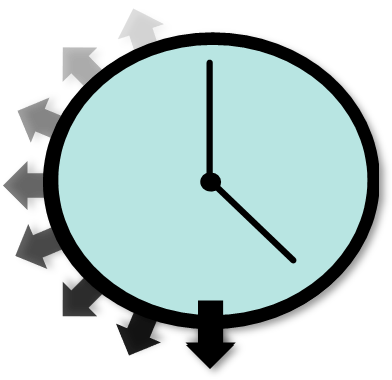
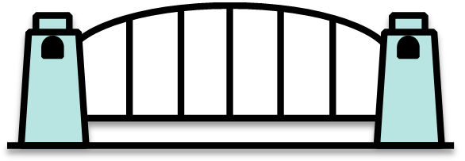 

## Misc
* **Views**
* **Staging**  

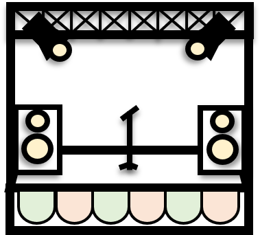
