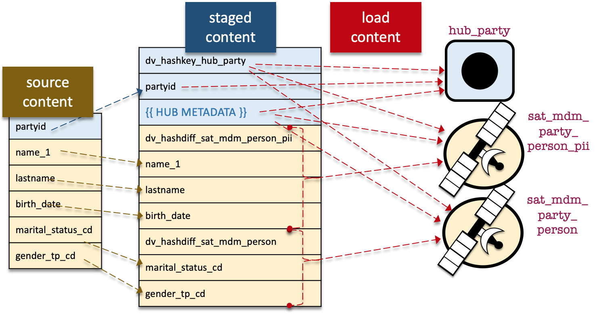
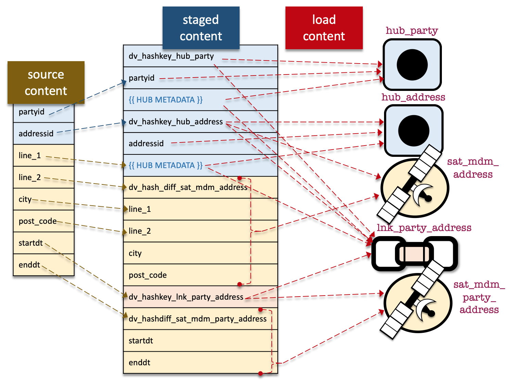
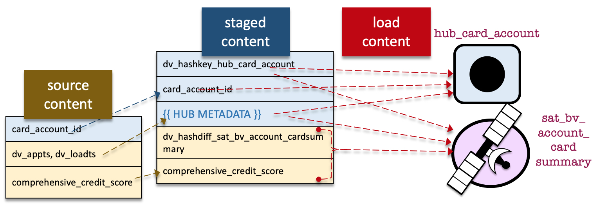
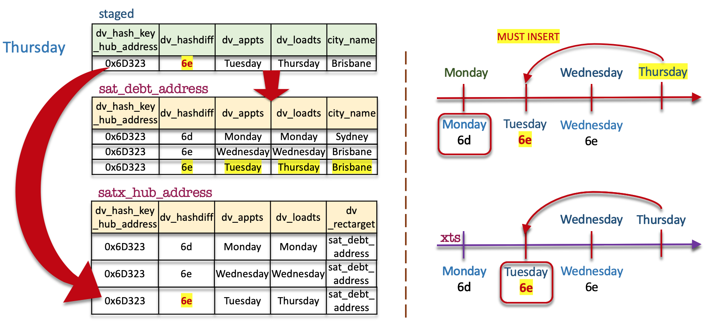

Figure 7-11 Ensuring the hub-hash key line loads to the child satellite as well

Inline-style:

Figure 7-12 Ensuring the hub-hash key line loads to the child satellite as well

Inline-style:

Figure 7-14 Ensuring the hub-hash key line loads to the child satellite as well

Inline-style:

Figure 8-16 has a mistake in the timeline, corrected image is here

Inline-style:

