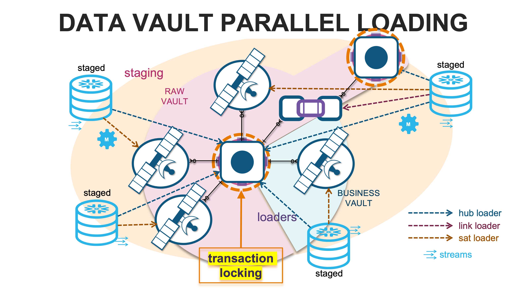
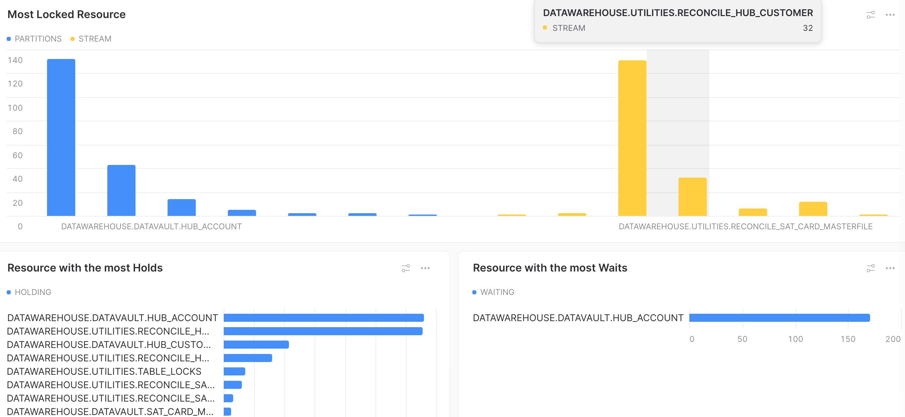

# thedatamustparallelload
#datavault #data-vault
  I only ask that you give credit as to where you got this testing framework from. 
The art and code are provided under Creative Commons licensing. 
 This work is licensed under a <a rel="license" href="http://creativecommons.org/licenses/by/4.0/">Creative Commons Attribution 4.0 International License</a>.

	
	
